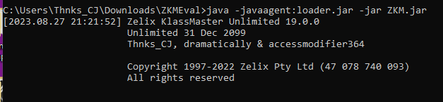
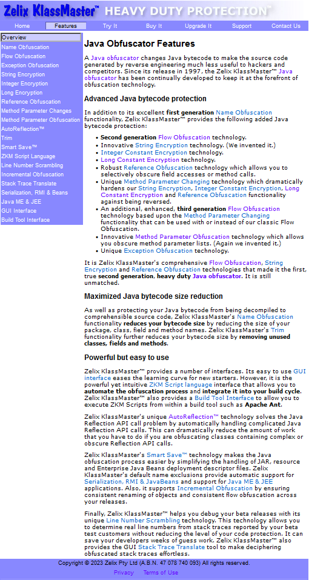
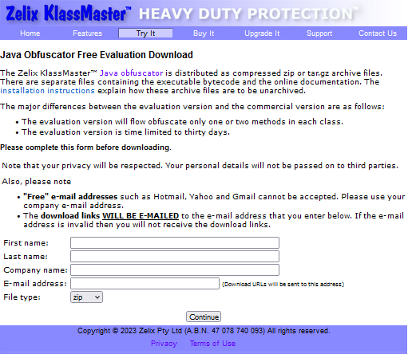
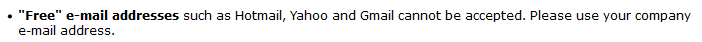
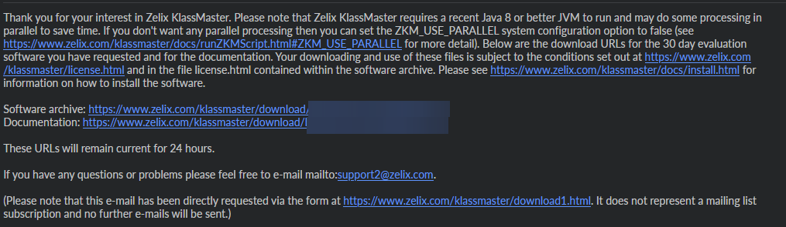
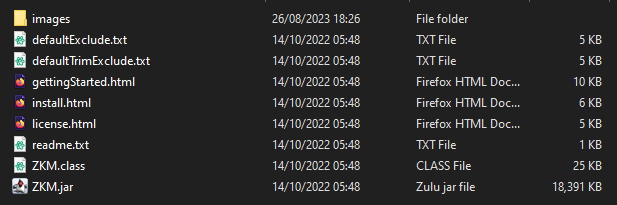

# Cracking Zelix Klassmaster

> Original post: https://thnkscj.github.io/posts/cracking-zkm/



## Introduction

One of the best obfuscators on the market but first off we need to establish that none of this was done in ill intent,
and we simply wanted to challenge ourselves. Because of this we won’t release the crack or our code. But we cant stop
you copying what we did and making your own version of the crack. All the code shown here is unique to our copy of ZKM
and will be different for you.

## Research

Now that that is out of the way we can get down to business. Let’s start at the beginning their website. From first
glace you may notice that it is a bit out of date. Visually it looks straight out of the 2000’s but don’t let that fool
you. This obfuscator is at the top of the market. Navigating though the website there is a features page on the header.



It has all the standard features you would expect a modern java obfuscator to have and clicking on each feature gives
you a description of what it does if you are new to this. Moving on we come to “Try it”.



We are greeted with a forum submission to receive a evaluation copy of ZKM to test. The thing that sticks out most is
this.



But luckily for me, I have my own mail server and with that an email that qualifies for there acceptance policy. After
filling this forum out with information I get a copy of ZKM emailed to me.



Here we get a little bit of information on the obfuscator. It links us to the docs and too there support email if we
have any further questions. What we are after is the download links. After downloading the ZIP file and extracting it we
get all the files needed to run and crack ZKM.

## The ZIP File



Here we can find the ZKM jar and the other files related to it. If we want to crack it we first need to understand how
the authentication works, we can turn off our Wi-Fi and see that when running ZKM it can still authenticate, and we can
obfuscate a file, meaning that it is all done offline so somewhere there will be logic that knows if the 30-day trial is
over and if it is an evaluation copy or not. Luckily I have access to a very cool program. A full ZKM deobfuscator,
since ZKM is protected with its own obfuscator that means that we can have a peak at the code, find the authentication
methods and remove the flow obfuscator limit of only a few methods per class. However, it won’t be able to recover any
of the original class names, so we will have to find it all ourselves. Before we crack it we have to first understand
how the authentication works.

## Authentication Inner Workings

Knowing that ZKM works as an offline application, what if we change the machine’s Date to the past? (psd: you can’t).
ZKM developers already knew that, so they implemented some checks for avoiding this.

This is the class which contains three encrypted dates stored as strings in static fields, these fields are private and
returned in three instance methods.

```java
// deobfuscated
public class tl extends t7 {

    private static final String d;
    private static final String a;
    private static final String e;

    static {
        d = "WbGOSe0eeA";
        a = "Vbgm0ee0A";
        e = "V4QIX66fY66PE";
    }

    public String j() {
        return e;
    }

    public String R() {
        return a;
    }

    public String l() {
        return d;
    }
}
```

This is the class which decrypts the encrypted dates, turning it into primitive long values.

```java
// deobfuscated
public final class emp {

    public static long L(String string) {
        char[] cArray = string.toCharArray();
        char[] cArray2 = new char[cArray.length];

        for (int i = 0; i < cArray.length; ++i) {
            char c = cArray[i];
            if (c >= '0' && c <= '9') {
                if (c > '0') {
                    c = (char) (58 - c + 48);
                }
            } else if (c >= 'A' && c <= 'J') {
                c = (char) (c - 17);
            } else if (c >= 'K' && c <= 'T') {
                c = (char) (c - 27);
            } else if (c >= 'U' && c <= 'Z') {
                c = (char) (c - 37);
            } else if (c >= 'a' && c <= 'd') {
                c = (char) (c - 43);
            } else if (c >= 'e' && c <= 'n') {
                c = (char) (c - 53);
            } else if (c >= 'o' && c <= 'x') {
                c = (char) (c - 63);
            }
            cArray2[i] = c;
        }

        return Long.parseLong(new String(cArray2));
    }
}
```

This is the class which does the validations.

```java
// deobfuscated
public final class ew extends tl {

    public static String r(
            String string, // V4QIX66fY66PE
            String string2, // WbGOSe0eeA
            String string3, // Vbgm0ee0A
            Object object
    ) {
        try {
            String string4 = object.getClass().getName();
            SimpleDateFormat simpleDateFormat = new SimpleDateFormat("dd MMM yyyy");
            TimeZone timeZone = TimeZone.getDefault();
            simpleDateFormat.setTimeZone(timeZone);

            long l = emp.L(string); // 1668344144454L Sun Nov 13 08:55:44 VET 2022
            long l2 = emp.L(string2); // 2764800000L Sun Feb 01 20:00:00 VET 1970
            long l3 = emp.L(string3); // 172800000L Fri Jan 02 20:00:00 VET 1970
            Date date = new Date(l);
            String string5 = simpleDateFormat.format(date);
            long l4 = System.currentTimeMillis();

            // Checks if the value of l3 multiplied by 4 times itself is equal to the value of l2.
            if (l3 * 4 L * 4 L != l2){
                throw new h_(string5 + (b0.gF ? " (01)" : ""));
            }

            // Checks if the current time is greater than the value of l.
            if (l4 > l) {
                throw new h_(string5 + (b0.gF ? " (02)" : ""));
            }

            // Checks if the current time is less than the value of l minus the value of l2.
            if (l4 < l - l2) {
                throw new h_(string5 + (b0.gF ? " (03)" : ""));
            }

            J = string;
            long l5 = l4 + l3;
            eru eru2 = new eru(System.getProperty("java.class.path"), c2.b);
            Object[] objectArray = eru2.y();

            // Iterate files in the java classpath
            for (int i = 0; i < objectArray.length; ++i) {
                if (objectArray[i] instanceof File) {
                    long l6 = ((File) objectArray[i]).lastModified();
                    // Checks if the last modified time of the current file is less than or equal to the value of l5
                    if (l6 <= l5) continue;
                    throw new h_(string5 + (b0.gF ? " (04)" : ""));
                }

                File file = new File(((ZipFile) objectArray[i]).getName());
                if (!file.exists()) continue;
                long l7 = file.lastModified();

                // Checks if the last modified time of the current file is greather to the value of l5
                if (l7 > l5) {
                    throw new h_(string5 + (b0.gF ? " (05)" : ""));
                }
                if (!file.getName().endsWith("ZKM.jar")) continue;
                e8c e8c2 = null;
                try {
                    e8c2 = new e8c(file);
                    ZipEntry zipEntry = e8c2.getEntry(string4.replace('.', '/') + ".class");
                    if (zipEntry == null) continue;
                    long l8 = zipEntry.getTime();
                    // Checks if the time of the entry is greater than the value of l5
                    if (l8 > l5) {
                        throw new h_(string5 + (b0.gF ? " (06)" : ""));
                    }

                    // Checks if the current time is greater than the time of the entry plus the value of l2.
                    if (l8 != -1 L && l4 > l8 + l2){
                        throw new h_(string5 + (b0.gF ? " (07)" : ""));
                    }
                    ((ZipFile) e8c2).close();
                    continue;
                } catch (IOException iOException) {
                    continue;
                } finally {
                    if (e8c2 != null) {
                        try {
                            ((ZipFile) e8c2).close();
                        } catch (IOException iOException) {
                        }
                    }
                }
            }
            eru2.F();
            return string5;
        } catch (NumberFormatException numberFormatException) {
            throw new h_(b0.gF ? " (08)" : "");
        }
    }
}
```

After getting every decrypted date as long, you can turn it into `java/util/Date` objects. Our three dates are;

- **Fri Jan 02 20:00:00 VET 1970** (Initial date for calculating the time)
- **Sun Feb 01 20:00:00 VET 1970** (Final date for calculating the time; one month after the initial date)
- **Sun Nov 13 08:55:44 VET 2022** (Expiration date)

Now we understand how the authentication works we can move onto how we cracked it. In simple, we made ZKM think that
the license expires many years from now practically making it “never expire” (in our lifetime) Alright, there are many
validations around the JAR so the best way to do this was analyze the validations and tweak
the `com/zelix/emp:L(Ljava/lang/String;)J` method, returning predefined long values from a custom date.

We replace the old method to this:

```java
// deobfuscated
public final class emp {

    public static long L(final Object[] var0) {
        final LocalDate ld = LocalDate.of(2099, 12, 31);
        final Date d = Date.from(ld.atStartOfDay(ZoneId.systemDefault()).toInstant());

        switch ((String) var0[0]) {
            case "V4QIX66fY66PE":
            case "WbGOSe0eeA":
                return d.getTime();
            case "Vbgm0ee0A":
                return d.getTime() / 4L / 4L;
        }

        throw new RuntimeException("Error decrypting expiration date!");
    }
}
```

Which hard-codes our fake expiry date into the check method. Now that our copy of zkm will never run out (in our
lifetime) we can move onto removing the control flow limiter.

## Removing the control flow limiter

The control flow limiter is a block put in place by ZKM to prevent it from flow obfuscating more than 2-3 methods per
class. This is so-that you cant use the evaluation version to obfuscate your entire project and avoid paying them. We
can remove this by patching the `com/zelix/emp:UY()V` and `com/zelix/emp:qh()V`

In short, we replaced the following instructions in `com/zelix/emp:UY()V`:

```
	iload i57
	iload i56
	if_icmple S
	goto T
```

With this:

```
R:
	iload i57
	iload i56
	pop2
	goto S
	goto T
```

And the following instructions in `com/zelix/emp:qh()V`:

```
M:
  iload i42
  iload i41
  if_icmple N
  goto O
```

With this:

```
M:
	iload i42
	iload i41
	pop2
	goto N
	goto O
```

This will make the control flow limiter think that it doesn’t have a limit and will flow obfuscate as many methods as we
want. We also change another thing, but I won’t be sharing that here.

## Changing the license info

The license info is stored in the `com/zelix/tl` class, and is loaded into the `j` field.

```java
    public tl() {
        String[] stringArray = new String[]{
                "License No.:                                         ",
                "none                                                 ",
                "License Type:                                        ",
                "30 day evaluation expiring                           ",
                "Licensee:                                            ",
                "(name) - (company)                                   ",
                "                                                     ",
                "(email)",
                "Not used                                             ",
                "Not used                                             "
        };
        this.j = stringArray;
    }
```

This contains the license info, and we in the evaluation version we can change anything we want. We change it to the
people who helped along the way.

```java
instructions.add(new VarInsnNode(Opcodes.ALOAD,0));
instructions.add(new FieldInsnNode(Opcodes.GETFIELD,className,"j","[Ljava/lang/String;"));
instructions.add(new LdcInsnNode(5));
instructions.add(new LdcInsnNode("Thnks_CJ, dramatically & accessmodifier364"));
instructions.add(new InsnNode(Opcodes.AASTORE));
```

We can remove the `Evaluation` watermark by patching the field `com/zelix/ew:k`.

## Overview

We have now cracked ZKM, and we can now use it to obfuscate our projects without any limitations. But this was all for
educational purposes, and I do not condone piracy. If you want to use ZKM, please buy it from the official
website: https://zelix.com/ (I am not affiliated with them in any way).

The reason I am not sharing part of the way we removed the control flow limiter is because I want people to figure it
out themselves. I am not going to spoon-feed you everything, and I want you to learn something from this.

I hope you enjoyed this write-up, and learned something from it. If you have any questions, feel free to contact me on
Discord: `thnks_cj` but please don’t ask me for the control flow limiter patch, I will not share it, and I will not help
you with it. Same goes for any other part of the crack may that be the Deobfuscated ZKM jar or the java agent we used to
crack it.
